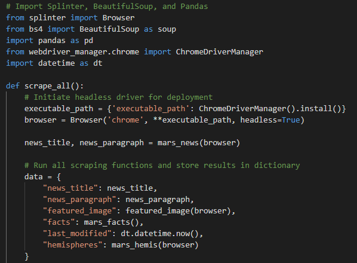
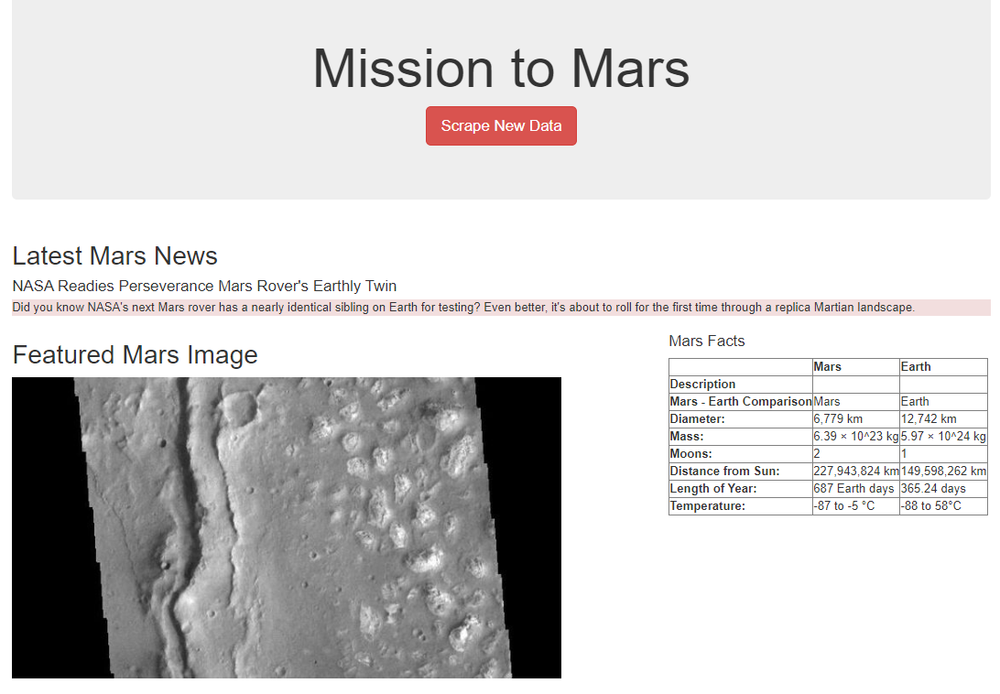

# Mission to Mars!

## Overview of the project:
---
With an ambitious goal of working for NASA someday, I spend a lot of time cruising sites about space exploration. As a junior Data Scientist, I know there has to be a more efficient way to get the most up to date news at the push of a button. I decided to write a script to gather all of the recent news articles from sites I usually visit and display them in one place for easy review. 

## Results: 
---
Tools used:
    -   Python
    -   Beautiful Soup
    -   Splinter
    -   Flask
    -   Mongo DB
    -   HTML
    -   Bootstrap

    1. Scraping with BeautifulSoup

    My first step was identifying which websites I visit regularly have the most relevant news I'd like to display on my website. Once that was identified I wrote a Python script using Splinter and BeautifulSoup to scrape relevant items from my favorite webpages and store them in a Data dictionary.
    

    2. Hosting with Flask
    
    Once I had this Scraped information I used another Python script to load that Data dictionary into MongoDB and used Flask to host that locally on the web.

    3. Formatting with Bootstrap

    Finally, I used HTML, CSS and Bootstrap to write an HMTL code to use as the format for Flask to read and use as the finished product.

 

## Summary: 
---
This new tool will save me a great deal of time, with just the push of a button I get the most up to date article on Mars exploration and with a little more polishing I'll be able to share this with others passionate about space exploration and even hopefully get the the attention of NASA! 
